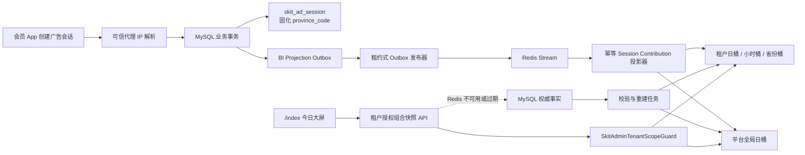

# 今日广告消费实时指挥中心设计

日期：2026-07-31

状态：设计已口头确认，待书面审阅

范围：`skit-saas-backend`、`skit-saas-frontend`

采用方案：C —— `/index` 保留普通数据总览入口，同页提供全视口“指挥中心”模式；MySQL 保存权威事实，Redis Stream 驱动按租户隔离的实时投影

## 已确认的产品决策

1. 首页展示“当天广告消费”，统计窗口固定为 `UTC+8` 自然日 `00:00:00` 至服务端确认的一致快照时刻 `asOf`，不是滚动 24 小时。
2. 消费口径以当天创建的广告会话为 cohort。会话后续发生的展示、奖励、解锁、失败和可信收益变化，回写该会话的创建日与创建小时桶。
3. 3D 中国地图默认按各省“广告会话数”着色并显示柱高；可切换客户端展示、可信平台 Impression、签名奖励和失败数。
4. 地域只由服务端在创建广告会话时，根据可信代理链解析出的客户端 IP 固化为省级行政区代码。客户端提交的省份、经纬度和设备定位均不作为事实。
5. MySQL 是广告会话、奖励、权益、收益、对账与分成的唯一权威事实源；Redis 只保存可丢失、可重建的实时 BI 投影。
6. 租户管理员只能查看登录令牌绑定的原始租户；只有经过服务端验证的平台 `super_admin` 才能查看全局或指定租户。
7. 选用 C“指挥中心”视觉，但不新增业务路由。普通 `/index` 提供“进入大屏”按钮，同一页面以全视口覆盖层展示大屏；退出后保留租户、指标和省份选择。
8. 页面只展示真实服务端事实。Demo 中的随机值、模拟收益、演示飞线和失败后的伪造兜底数据不得进入生产代码。

## 目标

- 让运营人员进入 `/index` 后可以快速了解当天广告会话总量、地域分布、小时趋势、验证漏斗、按币种收益和数据健康。
- 大屏读请求优先命中 Redis，避免每个浏览器每几秒重复执行多表聚合。
- 新事实正常情况下在 3 秒内反映到 Redis 快照；前端每 3 秒读取一次授权范围内的组合快照。端到端可见目标单独按“投影延迟 + 下一次轮询”等待时间验收。
- Redis 故障、消息重投或数据丢失不能改变 MySQL 权威事实，也不能造成重复累计；系统必须可以从 MySQL 重建投影。
- 所有管理端视图、Redis 键、消息和回退查询都保持同一租户范围，避免切换租户时短暂展示旧租户数据。
- 3D 地图在 16:9 电视墙、1920×1080 桌面和常见管理后台窗口中清晰可读，并在离开页面时释放或暂停 GPU 资源。

## 非目标

- 本期不提供历史任意日期大屏。历史明细仍由现有广告消费页和广告监控页承担。
- 本期不展示广告主买量成本。“广告消费”指会员对广告的请求、展示、奖励与解锁消费；金额是广告展示收益，不能标成“投放消耗”或“广告费”。
- 本期不按省份汇总金额。地域图只显示可跨币种安全汇总的次数；收益继续按 `currency + amountScale` 分组。
- 本期不提供市、县下钻，也不展示客户端自行上报的飞行路线。
- Redis 不承担权益、收益、对账或佣金账本写入，不作为财务审计来源。
- 不直接复制当前 Three.js Demo 的源码、纹理或地图资产。Demo 授权和地图来源不满足生产并入条件。

## 总体架构



写路径仍以 MySQL 提交成功为完成条件。Redis 发布、消费和大屏刷新均在事务之外发生，不能延长广告会话、奖励回调或收益回调的主事务。Outbox 与业务事实同事务写入，避免 MySQL 已提交而刷新事件永久丢失。

## 当天与小时归属

### 服务端决定业务日

组合快照 API 不接受客户端时区参数，本期固定使用 `UTC+8`。服务端以自己的时钟计算：

```text
businessDate = UTC+8 的当前日期
startTime = businessDate 00:00:00
endTime = asOf
window = [startTime, endTime)
```

前端不根据浏览器本地时区计算零点，也不把浏览器 `now` 作为结束时间。这样不会因用户电脑时区错误、时钟漂移或半开区间边界产生漏数。

`businessDate` 始终取请求时服务端的当前 `UTC+8` 日期。跨零点后不能继续返回前一日快照；若新日 Redis 水位尚未达到 `windowStart`，该快照视为未就绪并走空快照/MySQL 回退。前端发现响应 `businessDate` 改变时清空省份选择并以新日 00 时重新建图。

### Session cohort

所有漏斗次数按 `skit_ad_session.create_time` 所属的 `UTC+8` 日期和小时归桶：

- 会话在创建时贡献 `sessionCount=1`。
- 同一会话首次出现客户端上报 `SHOWN` 时贡献 `clientShownCount=1`。这是客户端观察事实，不标记为平台可信 Impression。
- 同一会话首次出现客户端奖励观察时贡献 `clientRewardObservedCount=1`。
- 服务端签名验证、权益授予、失败、早关与平台 Impression 均以每个会话最多贡献一次为原则。
- 次日到达的奖励或对账变化仍更新该会话的创建日桶，不计入次日新会话 cohort。

这保证 `广告会话 → 客户端展示 → 奖励观察 → 同会话签名验证 → 权益授予` 是可解释的同一 cohort 漏斗。

## 地域事实

### 会话创建时固化

为 `skit_ad_session` 增加：

```text
province_code int NULL
projection_revision bigint NOT NULL DEFAULT 0
projection_origin_outbox_id bigint NOT NULL DEFAULT 0
```

会话创建控制器使用现有 `SkitTrustedProxyClientIpResolver` 获取可信客户端 IP，再通过现有 `IPUtils` 和 `AreaUtils` 解析行政区并归一到省级代码。服务层只接收解析后的 `provinceCode`，不接受请求体中的地域字段。

`projection_revision` 是每个会话的单调版本；新会话以 revision 1 写入。任何可能改变该会话 BI 贡献的事务，都必须在同一事务中执行原子 `revision = revision + 1` 并追加带该 revision 的 Outbox。创建事务把 `SESSION_CREATED` Outbox ID 固化到 `projection_origin_outbox_id`；迁移前存量会话保留 0，由首次 generation baseline 全量纳入。投影器在同一个一致性读取事务中取得 revision 和完整事实；若读取期间 revision 改变则重试，不能把多个提交版本拼成一个贡献。

规则：

- 中国大陆及系统能够识别的港澳台省级代码写入 `province_code`。
- 内网地址、保留地址、无法识别的 IPv4/IPv6、境外地址或解析异常写 `NULL`，在响应中计入 `unknownRegion` 的对应指标。
- 不在 `skit_ad_session` 保存原始 IP，不向 Redis、管理端响应、日志或埋点传递原始 IP。
- 存量会话不使用会员注册 IP 或最新登录 IP回填，因为它们不能证明广告会话发生地。存量地域显示为未知。
- 新增面向 MySQL 回退聚合的索引：

```text
(tenant_id, create_time, province_code, id)
```

两个广告会话创建入口必须使用同一个地域解析组件，避免会员 OAuth 与原生播放器 grant 路径口径不同。

## MySQL Outbox

新增 `skit_dashboard_projection_outbox`，只承载刷新通知，不复制财务金额：

```text
id bigint
tenant_id bigint
ad_session_id bigint
source_revision bigint NOT NULL
cause_type varchar(32)
lease_owner varchar(64) NULL
lease_until datetime NULL
publish_status varchar(16)
projection_status varchar(32)
publish_attempt_count int
projection_attempt_count int
next_publish_attempt_at datetime NULL
last_error_code varchar(64) NULL
published_at datetime NULL
projected_at datetime NULL
create_time datetime
update_time datetime
```

`publish_status` 和 `projection_status` 初始均为 `PENDING`；增加唯一约束 `(tenant_id, ad_session_id, source_revision)`，保证每个贡献版本只产生一个刷新事实。

`cause_type` 至少覆盖：

- `SESSION_CREATED`
- `CLIENT_EVENT_CHANGED`
- `REWARD_STATUS_CHANGED`
- `ENTITLEMENT_CHANGED`
- `REVENUE_EVENT_CHANGED`
- `RECONCILIATION_CHANGED`
- `NATIVE_GRANT_CHANGED`
- `SESSION_DELETED`

所有能改变广告消费贡献的事务，在同一事务追加一条 Outbox。发布器复用现有回调 Inbox 的租约、重试与跳过锁模式：

1. 通过 `(publish_status, next_publish_attempt_at, id)` 索引领取 `PENDING / RETRY_WAIT` 行。
2. 发布 `DashboardProjectionRefreshMessage(outboxId, tenantId, sessionId, sourceRevision)` 到 Redis Stream。
3. 成功后标记 `publish_status=PUBLISHED`。
4. Redis 故障进入有上限的指数退避，不影响业务事务；持续失败进入告警和重建队列，不能静默丢弃。

XADD 成功但 MySQL 状态未提交会产生重复消息，因此消费端必须幂等；不能依靠“消息只投递一次”保证正确。

投影器读取会话时必须包含软删除行，并在确认消息 header 租户、payload 租户和数据库行 `tenant_id` 三者一致后把软删除状态计算为零值 tombstone。会话已经被物理移除、无法读取或租户不匹配时不得仅凭消息撤销贡献，应把 Outbox 标记为 `REPAIR_REQUIRED`、告警并触发该租户日桶的 MySQL 重建。两侧投影成功后写 `projection_status=APPLIED, projected_at=now` 再 ACK；崩溃造成的重投由 revision 幂等吸收。成功应用的 Outbox 保留 8 天后分批清理，未成功记录在修复完成前不删除。

定时补偿器扫描超时的 `publish_status=PUBLISHED AND projection_status=PENDING` 行并重发同一个 `outboxId`；这覆盖 XADD 成功后、消费者收到前单 Redis/AOF 丢失 Stream 记录的情况。超过补发门槛仍未应用时标记 `REPAIR_REQUIRED` 并重建对应 scope/date。重建 generation 成功后，把其连续高水位覆盖且已由 canonical snapshot 吸收的 Outbox 标记 `APPLIED_BY_REBUILD`，再推进连续水位，不能留下永久 pending。

## Redis 实时投影

### Redis 的角色

Redis 保存查询优化后的派生数据，不保存唯一业务事实。当前生产 Compose 是单 Redis 6.2 并开启 AOF；AOF 能改善重启恢复，但不等于高可用。Redis 故障时大屏允许降级，广告主链不能依赖大屏投影成功。

### Stream 与租户上下文

使用专用 Stream `skit:bi:projection:stream:v1` 和消费组 `skit-bi-projector-v1`。Outbox 跨租户扫描在 `TenantUtils.executeIgnore` 中完成，但发布每条消息前必须进入 `TenantUtils.execute(tenantId)`；`TenantRedisMessageInterceptor` 只复制当前线程上下文，不能替代显式设置。消费者在任何数据库读取或 Redis KeyBuilder 调用前校验 header tenant、payload tenant 和 DB session tenant。

消费者使用 Redis 6.2 的 pending 检查与 `XAUTOCLAIM` 回收超时消息。Stream 不能按固定 `MAXLEN=10000` 无条件裁剪；清理只能越过消费组已确认水位，绝不能先裁掉 pending 消息。监控至少包含未发布 Outbox、最老未发布年龄、Stream 长度、PEL 数、最老 pending 年龄、重试数、`REPAIR_REQUIRED` 数和投影延迟。超过重试门槛的毒消息持久标记到 MySQL Outbox 修复状态后才能 ACK，并由重建任务处理；Redis 内 DLQ 不能作为唯一故障记录。

### Session Contribution

投影器收到消息后，在已授权租户上下文中从 MySQL 读取该会话的完整当前事实，计算一个规范化贡献：

```text
sessionCount
clientShownCount
clientRewardObservedCount
signedVerifiedCount
signedVerifiedAndClientObservedCount
entitledCount
nativeGrantAccessCount
failedCount
earlyClosedCount
platformImpressionCount
currencyGroups[{currency, amountScale, platformImpressionCount,
                reconciledImpressionCount,
                estimatedAmountUnits, reconciledAmountUnits}]
provinceCode
businessDate
hourBucket
loadedRevision
sourceFingerprint
```

Redis 同时保存该会话上一次贡献。Lua 脚本在一个租户日桶哈希槽内原子执行：

1. 新 `loadedRevision` 低于已保存 revision 时拒绝应用，防止并发消费者把旧读回写。
2. revision 相同且 `sourceFingerprint` 相同则直接返回，重复消息不累计；revision 相同但 fingerprint 不同则拒绝并告警。
3. 只有更高 revision 才从日汇总、小时桶、省份桶、省份小时桶和币种桶减去旧贡献，再加上新贡献。
4. 保存新的会话贡献、revision、快照版本、`asOf` 和最近 Outbox ID。

这样状态从 `SHOWN` 变为 `FAILED`、收益事件变为 `mock`、对账金额被冲正或会话软删除时，都能正确撤销旧值并应用新值，而不是只增不减。

消息中的 `sourceRevision` 只是最低预期版本。Canonical loader 一致性读取到的 `loadedRevision` 才写入 contribution；`loadedRevision < message.sourceRevision` 时重试，持续不满足则进入修复。这样旧消息可以合并读取到更高的当前版本，但不能把新事实伪装成旧 revision。

Lua 不得在 active generation 或预期旧 contribution 缺失时把旧值默认为 0。Baseline 只纳入 `projection_origin_outbox_id=0` 或 `<= H` 的 session；`origin > H` 的 session 即使在 MySQL 一致性快照中已经可见，也统一由 `H` 之后的 replay 加入。

每个 generation 维护 `initializedSessions` marker 集合以及写入 meta 的 `expectedInitializedCount`。只有 `origin > H`、当前 generation 没有该 session marker、且 marker 数与 meta 完整性计数一致时，才允许从零加入；同一个 Lua 原子写 contribution、marker 并递增完整性计数。Marker 已存在但 contribution 缺失，或 marker 集合/计数不一致时，必须返回 `REBUILD_REQUIRED`。因此新 session 首次加入后即使 contribution 被局部淘汰，后续 revision 也不能再次从零累计；内存淘汰或 `FLUSHDB` 同样不允许先写出部分日桶。

金额始终使用整数 `amountUnits` 和独立 `amountScale`，通过 `HINCRBY` 更新；禁止使用浮点数累计金额。

租户与平台全局投影位于不同 Redis Cluster 槽，不能伪装成一个跨槽原子事务。二者各自保存独立的 `(tenantId, sessionId, loadedRevision, sourceFingerprint)` 应用状态并分别执行 Lua。消费者只有在租户投影和全局投影都成功后才 ACK；若进程在两者之间退出，重投会跳过已完成的一侧并补齐另一侧。

投影、MySQL 回退、重建和 shadow compare 必须共用一个 canonical contribution loader。每个 session 的最新可信收益统一取 `deleted=0 AND legacy_unverified=0 AND mock=0`，按 `occurred_time DESC, id DESC` 排序的第一条；各路径不得各写一套金额口径。

### 键空间

所有业务键显式包含授权后的租户和业务日；`v1` schema 已固定 `UTC+8`，若未来支持其他时区必须升级 schema/key 版本。不能假设原始 `RedisTemplate` 会自动添加租户：

```text
skit:bi:v1:{t:42:d:20260731}:active
skit:bi:v1:{t:42:d:20260731}:g:17:meta
skit:bi:v1:{t:42:d:20260731}:g:17:initializedSessions
skit:bi:v1:{t:42:d:20260731}:g:17:summary
skit:bi:v1:{t:42:d:20260731}:g:17:hour:18
skit:bi:v1:{t:42:d:20260731}:g:17:province:440000
skit:bi:v1:{t:42:d:20260731}:g:17:province:440000:hour:18
skit:bi:v1:{t:42:d:20260731}:g:17:province:unknown
skit:bi:v1:{t:42:d:20260731}:g:17:province:unknown:hour:18
skit:bi:v1:{t:42:d:20260731}:g:17:currency:CNY:2
skit:bi:v1:{t:42:d:20260731}:g:17:session:981273
skit:bi:v1:{global:d:20260731}:active
skit:bi:v1:{global:d:20260731}:g:9:meta
skit:bi:v1:{global:d:20260731}:g:9:initializedSessions
skit:bi:v1:{global:d:20260731}:g:9:summary
skit:bi:v1:{global:d:20260731}:g:9:hour:18
skit:bi:v1:{global:d:20260731}:g:9:province:440000
skit:bi:v1:{global:d:20260731}:g:9:province:440000:hour:18
skit:bi:v1:{global:d:20260731}:g:9:currency:CNY:2
skit:bi:v1:{global:d:20260731}:g:9:session:42:981273
```

花括号部分作为 Redis Cluster hash tag，使单租户单日的 Lua 更新可以落在同一槽位。会话贡献键和已结束日桶默认保留 8 天；更早数据需要时从 MySQL 重建。

租户日桶是基础投影。平台全局日汇总、小时、省份、省份小时、币种和 session contribution 由投影器独立更新并由校验任务重建，只能在 `readTenantOrGlobal` 已授权的 `globalAction` 分支读取。全局 session contribution 同时包含原始 `tenantId` 和 `sessionId`，避免不同租户相同业务编号碰撞。浏览器和 API 都不能临时遍历所有租户键后自行求和。

### 校验与重建

- 每 5 分钟抽样比较 Redis 日汇总与 MySQL 权威聚合。
- 每日跨日后重算前一业务日，吸收迟到回调和对账变化。
- Redis 启动、`FLUSHDB`、版本升级或校验不一致时，按租户和日期重建。
- 快照保存 `snapshotVersion`、`asOf`、`continuousOutboxWatermark`、`projectionLagMs`、`projectorHeartbeatAt`、`schemaVersion` 和校验摘要；乱序消费得到的最大 Outbox ID 不能冒充连续水位。
- 重建先记录已提交 Outbox 的连续高水位 `H`，在 MySQL 一致性快照上构建新 generation `V`，再回放 `H` 之后的 session revision。
- 切换前对目标 scope 获取短时 fencing，追平到当前连续水位，然后原子更新 active generation 指针；实时投影器每次 Lua 都校验 generation token，发现切换则重新读取并重试。
- 旧 generation 在读请求耗尽并超过宽限期后删除，半成品和新旧混合快照永远不可读。

`asOf` 是同一快照版本确认的数据水位，不是 HTTP 响应生成时间；响应另带 `servedAt`。投影器通过经过 Outbox 发布器和 Stream 消费组的周期性 fence 推进水位，所以“当天没有新广告事件”不会被误判为延迟。`projectionLagMs` 取 fence 水位、最老未处理 Outbox/Stream pending 年龄和投影器心跳的保守值，不能简单使用“最后一条业务事件时间”计算。

组合 API 通过单 hash slot 的只读 Lua 一次读取 active generation 的 summary、hourly、regions、regionalHourly 和 currencyGroups；如果数据规模需要分批读取，则必须在读取前后校验相同 `snapshotVersion`，变化时整轮重试。不能把 Lua 更新过程中不同版本的键拼成一个响应。

## 组合快照 API

新增：

```text
GET /admin-api/skit/tenant/dashboard/today
```

查询参数：

```text
tenantId?     仅平台 super_admin 可使用
```

v1 不接受 `timezone`、`startTime` 或 `endTime`。`schemaVersion=v1` 已把业务时区固化为 `UTC+8`，服务端统一计算当天窗口，避免大屏接口演变成无界历史查询。

响应示意：

```json
{
  "scopeType": "TENANT",
  "tenantId": 42,
  "businessDate": "2026-07-31",
  "timezone": "UTC+8",
  "windowStart": 1785427200000,
  "asOf": 1785493598000,
  "servedAt": 1785493600000,
  "snapshotVersion": "v1:42:20260731:981273",
  "source": "REDIS",
  "projectionLagMs": 1180,
  "summary": {
    "sessionCount": 12684,
    "clientShownCount": 10952,
    "clientRewardObservedCount": 3284,
    "signedVerifiedCount": 3194,
    "signedVerifiedAndClientObservedCount": 3186,
    "entitledCount": 3102,
    "nativeGrantAccessCount": 0,
    "failedCount": 266,
    "earlyClosedCount": 162,
    "platformImpressionCount": 9426
  },
  "regions": [
    {
      "provinceCode": "440000",
      "provinceName": "广东省",
      "sessionCount": 2418,
      "clientShownCount": 2086,
      "platformImpressionCount": 1790,
      "signedVerifiedCount": 741,
      "failedCount": 42
    }
  ],
  "unknownRegion": {
    "sessionCount": 37,
    "clientShownCount": 29,
    "platformImpressionCount": 24,
    "signedVerifiedCount": 9,
    "failedCount": 2
  },
  "hourly": [
    {
      "hourStart": 1785427200000,
      "sessionCount": 182,
      "clientShownCount": 154,
      "platformImpressionCount": 128,
      "signedVerifiedCount": 46,
      "failedCount": 5
    }
  ],
  "regionalHourly": [
    {
      "provinceCode": "440000",
      "hourStart": 1785427200000,
      "sessionCount": 31,
      "clientShownCount": 27,
      "platformImpressionCount": 22,
      "signedVerifiedCount": 8,
      "failedCount": 1
    }
  ],
  "currencyGroups": [
    {
      "currency": "CNY",
      "amountScale": 2,
      "platformImpressionCount": 9426,
      "reconciledImpressionCount": 6814,
      "estimatedAmount": "1842.36",
      "reconciledAmount": "1206.18",
      "estimatedEcpm": "195.46",
      "reconciledEcpm": "177.01"
    }
  ]
}
```

所有时间点使用 epoch milliseconds，并由服务端按明确的 `UTC+8` 业务边界转换为 `Instant`；禁止依赖服务器 `systemDefaultZone()`。行政区代码是标识符而非数值，API 一律返回六位字符串。`regionalHourly` 与总 `hourly` 使用同一个 `snapshotVersion/asOf`，供省份点击后在前端切换趋势，不触发第二个、口径可能漂移的请求。平台全局响应使用 `scopeType=GLOBAL, tenantId=null`。

响应必须设置 `Cache-Control: no-store`，避免浏览器或中间缓存复用其他租户的今日快照。`servedAt` 是响应生成时刻，`asOf` 是全部指标共同的数据水位；前端不能用 `servedAt` 冒充数据新鲜度。当前及过去小时缺失桶补 0，未来小时补 `null`，判断依据是服务端 `asOf` 所在的 `UTC+8` 小时，不使用浏览器时钟。

`estimatedEcpm = estimatedAmount / platformImpressionCount × 1000`，`reconciledEcpm = reconciledAmount / reconciledImpressionCount × 1000`；对应分母为 0 时返回 `null`。金额字符串只由整数 units 和 `amountScale` 格式化，不能经过二进制浮点累计。

组合 API 复用 `SkitAdminTenantScopeGuard.readTenantOrGlobal`，但 Controller 先执行更严格的参数契约：

- 租户管理员省略 `tenantId`，后端使用登录令牌的原始租户。
- 任意非平台管理员只要显式传 `tenantId`，即使等于自身租户，也在调用 Guard 和查询服务前拒绝。
- 平台 `super_admin` 省略 `tenantId` 才能读取全局投影。
- 平台 `super_admin` 指定租户时，响应 `tenantId` 必须与目标一致。
- 前端选择的目标租户只放查询参数，不改写 `tenant-id` 请求头。

Redis 未命中、不可用或快照过期时：

1. Redis 可连接但快照 miss/stale 时，可使用 Redisson 单飞锁阻止同一范围并发击穿。
2. Redis 完全不可连接时不能尝试 Redisson；使用进程内按 scope 的 singleflight、数据库并发闸门、超时、熔断和全局范围独立限流。多实例间允许有限重复查询，不能因锁服务失败阻断回退。
3. 从 MySQL 使用 canonical contribution loader 构建临时快照，并在进程内按 scope 保存 3 秒短 TTL，阻止每次前端轮询连续击穿数据库。
4. 返回 `source=MYSQL_FALLBACK, projectionLagMs=null`；Redis 可连接时提交异步修复，完全断连时只记录可重试修复任务，等待恢复后执行。
5. MySQL 回退也失败时返回明确错误：新 scope 首次加载失败保持空白；同 scope 后续刷新失败可以保留该 scope 最后成功快照并标记“连接中断 / 数据已过期”。任何情况下都不能显示上一个 scope 的旧快照。

MySQL 回退在同一个一致性读取事务中固定 `asOf`，并返回独立的 `snapshotVersion=mysql:<scope>:<asOf>`；`servedAt` 仍表示 HTTP 响应生成时刻。

现有 `SkitAdAnalyticsServiceImpl` 的收益聚合没有排除 `mock`，而广告消费查询已经排除。实施时应统一使用 canonical trusted-revenue 过滤 `deleted=0 AND legacy_unverified=0 AND mock=0` 并补契约测试，避免首页不同图表出现不一致。

## `/index` 与 C 指挥中心

### 同页两种呈现边界

普通 `/index` 继续承担后台数据总览和大屏入口。进入大屏后：

- 使用 Vue `Teleport` 把 `RealtimeAdCommandCenter` 挂到 `body`。
- 覆盖层 `position: fixed; inset: 0`，隐藏管理后台侧栏、顶栏和内容留白。
- 覆盖层使用固定最高层级、焦点圈定和 `aria-modal`，锁定后台滚动并监听 `Escape` 退出，键盘焦点不能进入底层后台。
- 用户点击“进入浏览器全屏”时才对 `document.documentElement` 调用 Fullscreen API，保证 Teleport 到 `body` 的 Element Plus Tooltip/Select Popper 仍可见；浏览器拒绝时继续使用页面级伪全屏。
- 支持 `/index?screen=1` 首次创建页面实例时自动进入页面级大屏，方便电视墙固定书签；页面内“进入/退出”只修改局部 `screenOpen`，不得 `router.push/replace` 改写 query，因为当前 KeepAlive 以 `route.fullPath` 为 key，改 query 会重建实例。
- 退出后保留当前租户、地图指标、省份和快照，不重复创建业务状态。
- 路由停用或组件卸载必须关闭 Teleport 覆盖层、退出原生全屏、恢复 `body` 滚动并解除全屏、键盘和焦点监听，不能把覆盖层残留到其他路由。

### 16:9 信息布局

```text
顶部：标题 / 当前租户 / UTC+8 / asOf / Redis 延迟 / 退出
第一行：6 个今日 KPI
主体左侧：3D 中国地图，约 68% 宽度
地图角标：数据来源 / 审图号
主体右上：00–23 时广告会话趋势
主体右下：同 cohort 验证漏斗
底部左侧：按币种收益与 eCPM
底部右侧：未知地区、投影延迟、回退来源、数据健康
```

KPI：

1. 广告会话
2. 客户端上报展示及展示率
3. 可信平台 Impression 及覆盖率
4. 同会话签名奖励及验证率
5. 权益授予及解锁率
6. 失败和提前关闭

比率由同一快照中的整数计数计算：

```text
展示率 = clientShownCount / sessionCount
Impression 覆盖率 = platformImpressionCount / sessionCount
验签成功率 = signedVerifiedAndClientObservedCount / clientRewardObservedCount
解锁率 = entitledCount / signedVerifiedCount
```

分母为 0 时显示 `—`，不能显示 `0%` 或 `NaN`。

地图默认展示广告会话。地图工具栏允许切换：

```text
SESSION / CLIENT_SHOWN / PLATFORM_IMPRESSION / SIGNED_VERIFIED / FAILED
```

点击省份只从同一组合快照的 `regionalHourly` 切换右侧趋势，并更新 Tooltip/省份详情，不重新请求或重新决定租户范围。KPI、漏斗和收益继续表示当前租户/平台全局范围，不跟随省份筛选。切换租户时必须立即清空省份选择。

收益卡明确写“广告收益”，并按币种分面。没有可信收益事实时显示“暂无可信收益事实”；不得把 `null` 格式化为 0。

地图以外的趋势、漏斗和收益图复用项目已有 ECharts 6；指挥中心负责这些实例的 `resize`、KeepAlive 暂停和 `dispose`，不能留下页面退出后仍运行的监听器或动画。

普通首页新增的“今日广告消费”区块和 Teleport 大屏共用一个 `TodayDashboardController` 及同一组合快照；当前首页原有的广告收益、平台健康等旧区块可以继续读取 analytics overview，但必须复用同一个授权 `TenantScope`，在租户切换时与 today 快照一起清空、重载。首期不伪装成用 today 响应替代旧 overview 的全部字段。

```text
TodayDashboardController
  state
  selectScope(scope)
  refresh()
  activate()
  deactivate()
  dispose()
```

Controller 内部封装授权 scope、请求世代、AbortController、响应 scope 校验、非重叠轮询、健康状态和同 scope 最后成功快照。普通区块和大屏只读其状态，不各自发请求。

### 刷新和过期状态

- 页面激活时立即请求一次；每次请求完成后再 `setTimeout` 3 秒发起下一次，禁止用可能重叠的 `setInterval`。
- 同一轮只发一个组合请求，避免 KPI、地图和图表拿到不同 `asOf`。
- 切换租户使用请求世代号和 AbortController；先清空旧数据，再加载新范围。
- 页面进入后台或 `document.hidden=true` 时停止轮询和 WebGL/ECharts 动画，恢复可见时立即刷新一次。
- Controller 的 `activate/deactivate/dispose` 均幂等；`onMounted` 和 `onActivated` 不能各自启动一套轮询。切换 scope、停用、隐藏和卸载时都 abort 在途请求。
- 新 scope 首次加载失败时保持空白错误态；同 scope 后续轮询失败可保留该 scope 的最后成功快照，但必须显示“连接中断 / 数据已过期”，不能继续显示“实时”。切换 scope 绝不保留旧快照。
- `snapshotVersion` 未变化时只更新健康/时间状态，不重复更新 ECharts 或 Three.js。
- `source=REDIS` 且 `projectionLagMs <= 5s`：显示实时。
- `source=REDIS` 且 `5s < projectionLagMs <= 15s`：显示“数据延迟”。
- `source=REDIS` 且超过 15 秒，或来源为 MySQL 回退：显示醒目标识，不用动画伪装实时。
- 页面 `onDeactivated` 停止轮询和动画，`onActivated` 恢复；`onBeforeUnmount` 完整释放。

## Three.js 地图模块

地图引擎作为与业务鉴权无关的深模块，只接受业务 Adapter 校验过的视图模型：

```ts
interface ChinaMapViewModel {
  snapshotVersion: string
  asOfEpochMs: number
  metric: 'SESSION' | 'CLIENT_SHOWN' | 'PLATFORM_IMPRESSION' | 'SIGNED_VERIFIED' | 'FAILED'
  selectedProvinceCode: string | null
  regions: Array<{
    provinceCode: string
    provinceName: string
    value: number
  }>
}

interface ChinaMapGeometrySource {
  load(signal: AbortSignal): Promise<NormalizedChinaMapGeometry>
}

type Point2D = readonly [x: number, y: number]
type LinearRing = ReadonlyArray<Point2D>
type PolygonRings = ReadonlyArray<LinearRing>

interface NormalizedProvinceGeometry {
  provinceCode: string
  provinceName: string
  polygons: ReadonlyArray<PolygonRings>
}

interface NormalizedChinaMapGeometry {
  kind: 'PRODUCTION_APPROVED' | 'TEST_FIXTURE'
  assetVersion: string
  sourceLabel: string
  reviewNo: string | null
  coordinateSpace: 'MAP_LOCAL_2D'
  features: ReadonlyArray<NormalizedProvinceGeometry>
}

interface ChinaMapController {
  update(view: ChinaMapViewModel): void
  setActive(active: boolean): void
  destroy(): void
}

function createChinaMap(
  container: HTMLElement,
  geometrySource: ChinaMapGeometrySource,
  options: {
    signal: AbortSignal
    onProvinceSelect(code: string | null): void
  }
): Promise<ChinaMapController>
```

几何 Adapter 负责把已登记源坐标系投影到 `MAP_LOCAL_2D`。每个 feature 的六位 `provinceCode` 必须唯一，名称非空；`polygons` 使用 MultiPolygon 语义，每个 polygon 的首 ring 是外环、其余是洞，并使用一致的 winding。外环与洞均为至少 4 个有限坐标点的闭合 ring，禁止 NaN/Infinity、自交和退化面积。生产 Adapter 必须返回 `kind=PRODUCTION_APPROVED` 和非空 `reviewNo`；测试 Adapter 只能返回 `TEST_FIXTURE`。

业务 Adapter 校验 API 的 epoch milliseconds 时间戳，并拒绝重复省码、非六位省码、未知省码、负值、非安全整数和快照 scope 不匹配。`update` 是完整受控替换语义，指标、选中省份和各省值都以 `ChinaMapViewModel` 为准；缺失省份必须复位为零，`selectedProvinceCode=null` 必须清除内部高亮，不能残留上一个租户的状态。`setActive` 和 `destroy` 必须幂等；销毁后的 `update` 明确忽略并记录开发期告警。`ResizeObserver` 由模块内部持有。

`onProvinceSelect` 只向业务层提议新的 `provinceCode` 或 `null`，不直接持久化选择，也不触发网络请求；业务层更新受控状态后再通过 `update` 回传。模块不能读取 Token、`tenantId`、Axios、Pinia 或 Redis。业务层完成授权、响应租户校验和指标选择后，才把纯数据快照传给地图。生产与测试通过 `ChinaMapGeometrySource` 分离，生产 Adapter 只加载获批资产，测试 Adapter 只生成抽象 fixture。

创建过程必须可取消。调用方在 scope 切换、KeepAlive 停用或卸载时 abort；`geometrySource.load`、动态 import 和初始化每个阶段都检查 `signal`。若完成前被取消，Promise 以 `AbortError` 结束并按清理栈移除已经创建的 DOM、WebGL context 和监听器，禁止晚到初始化重新挂载。初始化成功后则由返回的 controller 负责后续生命周期。

### 独立重写与代码来源门禁

生产地图必须独立重写。不得以现有 Three.js Demo、其 Git 历史、构建产物或源码片段为模板做改名、删减、格式化或翻译；不得复制其 Shader、配置结构、类型字段、算法实现、DOM/CSS、注释、纹理、GeoJSON 或生成 bundle。允许参考本设计文档、Three.js/D3 官方文档和许可证明确且已登记的官方示例。

本项目不把该过程宣称为法律意义上的 clean-room。每个新增地图文件都必须在资产/代码来源清单中说明其来源和许可证。合并前执行路径与 import 禁止检查、第三方许可证检查、生成 bundle 内容检查，以及与 Demo 的代码相似性检查；发现实质性相似片段、Demo 哈希或不明来源依赖时阻止合并。

生产要求：

- 独立异步加载 Three.js 和地图资源，其他路由不下载地图 bundle。
- 不使用 `preserveDrawingBuffer`，设备像素比最多为 2。
- 省域几何只创建一次；数据刷新只更新材质、柱体矩阵和 Tooltip 数据。
- 首版柱体可使用 `InstancedMesh`；每 500ms 合并一次视觉更新，避免频繁重建 Mesh。
- 首版默认不启用 Bloom 或双 Composer；未来引入后必须重新通过包体、帧率和长稳门禁。
- 使用 `textContent` 或固定 DOM 构造 Tooltip，不能把后端名称拼接到 `innerHTML`。
- 普通模式与 Teleport 大屏复用同一个地图实例和 `WebGLRenderer`，进出大屏不得创建第二个 WebGL context。
- KeepAlive 停用时暂停 animation loop、退出原生全屏、恢复 `body` 滚动并解除 Escape/fullscreen 监听；恢复激活后由业务层重新设置 active。
- 销毁顺序为：停止 loop → 解除 context/DOM/observer/controls 监听 → 释放 composer render target、geometry、material 和实例私有 texture → `renderer.dispose()` → 移除 canvas/Tooltip DOM。共享资产必须有明确所有者，实例不得释放仍由缓存或其他实例持有的纹理。
- `webglcontextlost/restored` 监听器必须在销毁时移除；单个实例最多自动重建一次，第二次失败直接降级。
- 地图冷缓存首次进入至首帧触发的全部新增 JS、CSS、几何、图片和字体 gzip 传输总和不超过 700 KB，排除 source map，并由 CI 从构建 manifest 汇总；不得下载 Demo 的 3.5 MB 纹理。
- 无 WebGL 或初始化失败时降级为静态省份排行和 KPI，不能让整个首页白屏。

## 地图资产与公开上线门禁

当前 Demo 和仓库内旧 `china.json` 均没有足够的生产来源、授权和审图证据，不能并入公开站点。生产资产目录必须同时带人工可读 `README.md` 和机器可验证 `map-asset-manifest.json`。清单至少记录：

- `publisher`、`sourceUrl`、`obtainedAt`
- `licenseEvidence` 或书面授权引用
- `reviewNo`、`reviewArtifactVersion`
- `allowedTransformations`
- 每个文件的 SHA-256
- `productionApproved`、批准人和批准时间

自然资源部标准地图服务说明：直接使用标准地图需要标注审图号；对地图内容进行放大、缩小、裁切等编辑，公开使用前需要送审。C 方案会对省域边界进行投影、拉伸和交互着色，应按“编辑后的公开地图”处理，在生产发布前完成合规确认：

- 标准地图服务：<https://bzdt.tianditu.gov.cn/>
- 《地图管理条例》：<https://www.gov.cn/zhengce/zhengceku/2015-12/14/content_10403.htm>

标准地图网页本身不自动提供可用于 Three.js 的获批 GeoJSON/矢量边界，正式矢量数据来源仍是公开发布阻断项。生产运行时只加载已随版本发布并通过清单校验的本地资产，不在运行时调用 DataV、高德或其他第三方地图接口。普通模式、页面级大屏和浏览器全屏都持续展示地图来源与审图号；边界、投影、裁切、拉伸表现或重要标注变化时按新资产版本重新确认审图有效性。

`build:prod` 必须 fail-closed：清单缺失、必填字段缺失、SHA-256 不一致、`productionApproved!=true`、引用 fixture/旧 `china.json`/Demo 路径或命中已登记 Demo 哈希时，生产构建失败。该检查不能只依赖人工 README。

开发和自动化测试只使用程序生成的抽象矩形/多边形，不描绘真实中国国界、海岛或边界线。Fixture 只放在 `test/fixtures`，不得进入 `src/assets`、`public` 或生产依赖图；开发预览必须显示“测试几何，非正式地图”水印，生产构建发现 Fixture Adapter 即失败。没有获批资产时，不得把内部占位图发布到 `yunque8.top`。

## 租户隔离

### 请求边界

- `tenant-id` 请求头保持登录令牌原始租户，或由现有 Axios 逻辑生成。
- 租户管理员请求不能出现用户可选的 `tenantId`。
- 平台管理员选择目标租户时，只在查询参数附加 `tenantId`。
- Controller 先调用 `SkitAdminTenantScopeGuard`，查询服务只接收 guard 输出的授权 scope。
- Controller 和普通租户查询不得使用 `@TenantIgnore`。只有 guard 已授权的 `globalAction` MySQL 回退可以在最小代码块中进入跨租户读取，并且必须使用专用全局查询方法，不能复用由请求参数直接驱动的任意租户查询。

### Redis 边界

- Stream 消息通过现有 `TenantRedisMessageInterceptor` 携带租户头，但投影器仍验证 header tenant、payload tenant 与数据库会话租户三者一致。
- 原始 `RedisTemplate` 键不会自动租户隔离，所有 KeyBuilder 必须要求显式 `tenantId` 或受控的 `GLOBAL` scope。
- 单租户响应必须回显 `scopeType=TENANT` 和授权租户；全局响应回显 `scopeType=GLOBAL, tenantId=null`。
- 浏览器永远不能直连 Redis、指定 Redis key 或获得全租户明细后自行过滤。
- 缓存和日志不得保存原始 IP、手机号、会话 token、callback key 或广告密钥。

### 前端切换边界

- 切换前立即停止旧轮询、递增请求世代、清空 KPI、地图、趋势和省份选择。
- 迟到响应的 scope key、响应 `scopeType/tenantId` 或世代不匹配时直接丢弃。
- 大屏状态保持在 `/index` 局部 store，不跨租户复用快照。

## 错误处理

| 场景 | 行为 |
|---|---|
| 地域无法解析 | 会话正常创建，`province_code=NULL`，计入未知地区 |
| Outbox 暂时发布失败 | 退避重试；业务主事务不回滚 |
| Stream 重复投递 | 相同 revision 与指纹幂等跳过，不重复累计 |
| 消息乱序/并发旧读 | 消费端重读 MySQL 当前状态，Lua 拒绝较低 revision |
| Redis 不可用 | 授权后 MySQL 单飞回退，响应标记 `MYSQL_FALLBACK` |
| Redis 快照过期 | 显示数据延迟，并触发修复/重建 |
| active generation / 旧 contribution 局部缺失 | 拒绝增量写入，标记修复并从 MySQL 重建 |
| MySQL 与 Redis 不一致 | 以 MySQL 为准重建版本化命名空间 |
| 地图资源加载失败 | 保留 KPI、趋势和排行，显示地图降级提示 |
| WebGL 上下文丢失 | 暂停重建一次；再次失败降级 |
| 切换租户时旧响应到达 | 世代与 scope 校验失败，丢弃且不渲染 |
| 全屏 API 被拒绝 | 继续使用页面级固定覆盖层 |

## 测试设计

### 后端单元测试

- 可信代理、直连、伪造 `X-Real-IP`、内网 IP、IPv6、未知地区和中国省级归一。
- Session Contribution 对每种状态的贡献和撤销。
- 同一事件重复、乱序、状态回退、软删除、mock/legacy 收益切换。
- 两个消费者先后读到旧/新事实并逆序写入时，较低 `loadedRevision` 被 Lua 拒绝。
- rev1 消息读取到当前 rev2 时以 `loadedRevision=2` 安全应用；baseline 后新 session 即使首读高于 rev1 也可从零初始化。
- 金额按 `currency + amountScale` 使用整数 delta。
- Redis KeyBuilder 必须包含授权 scope、v1 schema 和日期。
- 组合 API 的当天半开窗口、跨零点换日、新日水位未就绪和 `asOf`。

### MySQL + Redis 集成测试

使用真实 MySQL 8 和 Redis 6.2 Testcontainers：

- Tenant A 与 Tenant B 存在相同 session 业务编号时完全隔离。
- Tenant A Token 不传 `tenantId` 只能读 A。
- Tenant A Token 显式传 A、传 B 或伪造 `tenant-id:B` 都在查询服务前被拒绝。
- 平台 `super_admin` 指定 A 只读 A；省略目标才能读全局。
- 普通租户误配 `super_admin` 角色仍不能进入平台全局。
- Outbox XADD 成功但状态提交失败造成重复时，最终只贡献一次。
- XADD 成功、消费者收到前 Stream/AOF 丢失消息时，超时 PUBLISHED/PENDING 补发或重建后连续水位恢复。
- Redis Stream pending 重投和消费进程重启后不重复累计。
- 租户投影成功、全局投影失败时，重投只补齐全局。
- Stream pending 超过旧清理阈值、Lua 后 ACK 前崩溃和 `XAUTOCLAIM` 后最终值仍正确。
- active generation 或旧 session contribution 被局部淘汰时 fail closed 并重建，不把旧值当零重复累计。
- Baseline 后新 session 首次加入再删除 contribution，处理下一 revision 时因 marker 已存在而重建，不重复累计。
- Redis 清空后可以从 MySQL 重建精确结果。
- 重建期间持续写 Outbox，generation 切换后无丢失、重复或混合版本。
- Redis 完全不可连接时不尝试 Redisson，MySQL 回退仍可用且受并发闸门保护。
- 无业务事件租户由 fence/heartbeat 推进水位，lag 不持续增长。
- API 多 key 读取与 Lua 更新并发时只返回单一 `snapshotVersion`。
- 任意 `mock=1` 或 `legacy_unverified=1` 的收益事实不进入 KPI、趋势、地图或收益卡。
- `reconciledImpressionCount` 与既有 MySQL 汇总口径一致。
- 次日迟到奖励更新前一日 session cohort，不增加次日会话。
- Redis 与 MySQL shadow compare 完全一致。

### 前端单元与组件测试

- `/index` 普通模式和 C 大屏模式共享同一 scope 与快照。
- `?screen=1` 进入页面级大屏；ESC 和退出按钮恢复后台。
- 浏览器 Fullscreen API 拒绝时仍保持页面级大屏。
- 租户切换先清空，旧请求迟到不渲染。
- 地图默认指标是广告会话，切换指标只改变映射值。
- 当前和过去缺失小时补 0，未来小时补 `null`。
- 省份小时趋势来自同一 `snapshotVersion`，未知地区每个指标满足“已知省份之和 + unknown = summary”。
- 多币种收益不相加，`null` 不显示为 0。
- source/lag 状态正确显示实时、延迟或 MySQL 回退。
- KeepAlive 激活、停用、页面隐藏和卸载时非重叠轮询、ECharts 与 Three.js 生命周期正确。
- `?screen=1` 只影响首次初始化；页面内进入/退出不修改路由 query 或重建实例。
- 服务端 `businessDate` 跨日后清空省份并重建 00–23 时序列。
- 静态测试禁止 `Math.random()`、模拟收益和 seeded fallback 进入首页。
- 地图 Adapter 拒绝重复/未知省码、负数、非安全整数和错误 scope；完整更新会把缺失省份复位，受控 `selectedProvinceCode=null` 会清除高亮。
- 几何加载或动态 import 完成前停用/卸载会触发 AbortError，晚到任务不创建 DOM、WebGL context 或监听器。
- 生产构建在资产清单缺失、哈希不一致、未批准或 fixture/Demo 进入依赖图时必须失败。
- 独立重写来源、许可证、禁止路径/import、bundle 哈希和相似性门禁均通过。

### E2E 与视觉测试

- 1366×768、1920×1080、2560×1440 下无关键内容遮挡。
- 普通 `/index`、页面级大屏和浏览器全屏切换。
- 地图选择省份后趋势联动，切换租户后选择被清空。
- 无 WebGL、地图资源 404、Redis 回退和空数据状态。
- Tenant A、Tenant B、平台全局和平台单租户四种授权视图。
- 普通模式、页面级大屏和浏览器全屏均显示生产地图来源与审图号。

### 性能门禁

- Redis 正常时组合快照 API 在目标压测环境下 P95 小于 200ms。
- 投影延迟 P95 小于 3 秒，P99 小于 5 秒。
- 3 秒非重叠轮询下，事实提交到页面可见的端到端延迟 P95 小于 6 秒，P99 小于 9 秒。
- 重复消息和重建期间不出现负数或跨租户数据。
- 地图冷缓存至首帧全部新增资源 gzip 总量不超过 700 KB；组合响应 gzip 体积纳入持续监控。
- 在 1920×1080、DPR 2、固定 Chrome 版本和发布门禁指定的参考集成显卡下，稳态 FPS 不低于 30，P95 帧耗时不高于 33ms。
- 1000 次快照更新后 `renderer.info.memory` 不持续增长；反复进入/退出大屏 100 次始终只有一个 WebGL context。
- CI 执行快速 mount/update/destroy 循环测试，持续运行 8 小时后再验证 JS heap、WebGL 资源和事件监听器无持续线性增长。

## 发布顺序

### 阶段 1：权威地域与 Outbox

- 增加 `province_code`、`projection_revision`、索引和 Outbox 表。
- 两个广告会话入口统一可信地域解析。
- 所有消费贡献变更事务追加 Outbox。
- 只写 MySQL，不向前端开放。

### 阶段 2：Redis Shadow Projection

- 发布 Stream 消息和幂等投影器。
- 运行租户日桶、全局日桶、校验和重建。
- 与现有 MySQL `/ad-consumptions/summary` 做 shadow compare。
- 至少连续 24 小时无差异后才允许大屏读 Redis。

### 阶段 3：组合 API

- 增加 `/dashboard/today` 和完整租户隔离测试。
- Redis 正常、延迟、丢失和 MySQL 回退全部验证。
- 修复现有 Analytics mock 过滤不一致。

### 阶段 4：`/index` C 指挥中心

- 接入同页大屏覆盖层、KPI、小时趋势、漏斗和数据健康。
- 接入独立 Three.js 地图模块与生命周期管理。
- 没有获批地图资产时只在内部环境使用测试 fixture。

### 阶段 5：公开发布

- 完成地图资产授权、审图和审图号展示。
- 完成 bundle、长稳、权限和双租户验证。
- 先单租户灰度，再平台全局，最后开放 `?screen=1` 电视墙模式。

## 验收标准

1. `/index` 可以在不离开当前路由的情况下进入和退出 C 指挥中心。
2. 默认显示当天 `UTC+8` 广告会话，地图默认以省级会话数渲染。
3. 当天 KPI、地图、小时趋势、漏斗和收益来自同一个 `asOf` 组合快照。
4. 投影延迟 P95 小于 3 秒、P99 小于 5 秒；3 秒轮询下端到端上屏 P95 小于 6 秒、P99 小于 9 秒。
5. Tenant A 无论修改查询参数、header、缓存或迟到请求，都不能看到 Tenant B。
6. 平台全局和平台单租户由服务端授权，普通租户不能进入全局分支。
7. Redis 重投、重启、清空和重建均不会改变 MySQL 事实或重复累计。
8. 任何 `mock=1` 或 `legacy_unverified=1` 收益完全排除；多币种金额不相加。
9. 原始 IP、客户端地域、随机 Demo 数据和未授权地图资产不进入生产响应。
10. 地图失败时 KPI 和图表仍可用；数据延迟或 MySQL 回退对用户明确可见。
11. 公开发布版本使用获批地图资产并在适当位置展示审图号。
